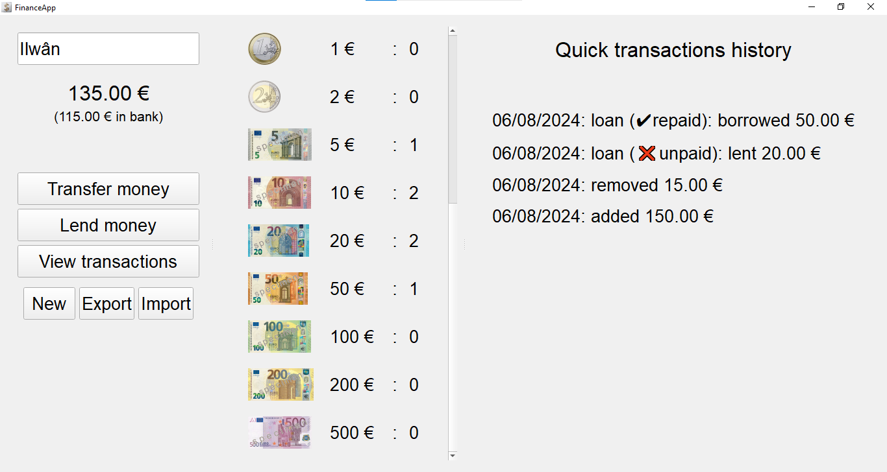
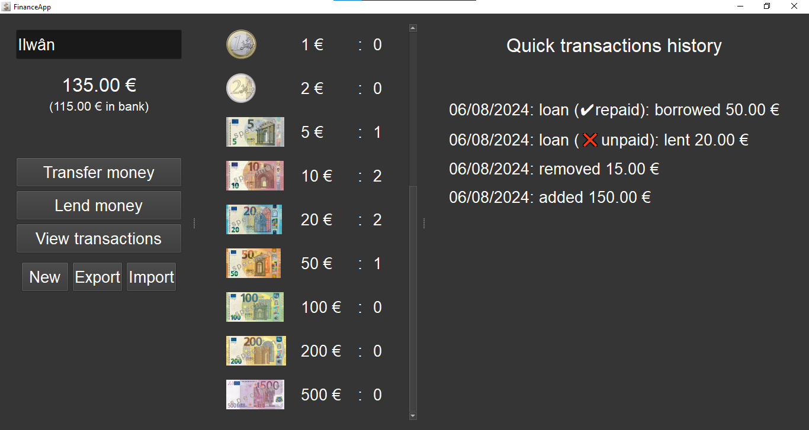

# FinanceApp

**EN:**

An app to manage and track the amount of money in you piggy bank.

How to use:

- Download and install the "installer" version, or just download and unzip the "portable" version, or download the Python source code, install the required libraries, and run directly.
- At first launch, select your currency (you will NOT be able to change that without recreating a new save).
- To add or remove money, click on the "Transfer money" button.
- To lend or borrow money, click on the "Lend money" button.
- To view all your past transactions and to repay loans, click on the "View transactions" button.
- You can create a new save with "New", and you can export a save with "Export" to save it somewhere and load it back with "Import".

Note: the whole system relies on the counting of coins and notes, so you should know that you must indicate which coins or notes where added or removed exactly each time you do a transaction.

Also, the application recalculates all the ammounts depending on all past transactions at each refresh, which can make it a bit slow on lower end computers after a lot of transactions. Sorry for the unoptimization.

**FR:**

Une application pour gérer et suivre l'argent de votre tirelire.

Comment l'utiliser :

- Téléchargez et installez la version "installer", ou simplement téléchargez et décompressez la version "portable", ou téléchargez le code source Python, installez les bibliothèques requises, et lancez directement le code.
- Au premier lancement, sélectionnez votre monaie (Vous ne pourrez PAS la changer sans recréer une nouvelle sauvegarde).
- Pour ajouter ou retirer de l'argent, cliquez sur "Transférer de l'argent".
- Pour prêter ou emprunter de l'argent, cliquez sur "Prêter de l'argent".
- Pour voir toutes vos anciennes transactions et pour rembourser les prêts, cliquez sur "Voir les transactions".
- Vous pouvez créer une nouvelle sauvegarde avec "Nouveau", et vous pouvez exporter une sauvegarde avec "Exporter" pour l'enregister quelque part et la charger à nouveau avec "Importer".

Note : l'entièreté du système se base sur le comptage des pièces et des billets, donc vous devriez savoir que vous devez indiquer quelles pièces ou billets ont été ajoutés ou retirés exactement à chaque fois que vous faites une transaction.

De plus, l'application recalcule toutes les valeurs selon toutes les anciennes transactions à chaque rafraîchissement, ce qui peut la rendre un peu lente sur les ordinateurs moins performants après une grande quantité de transactions. Désolé pour le manque d'optimisation.
